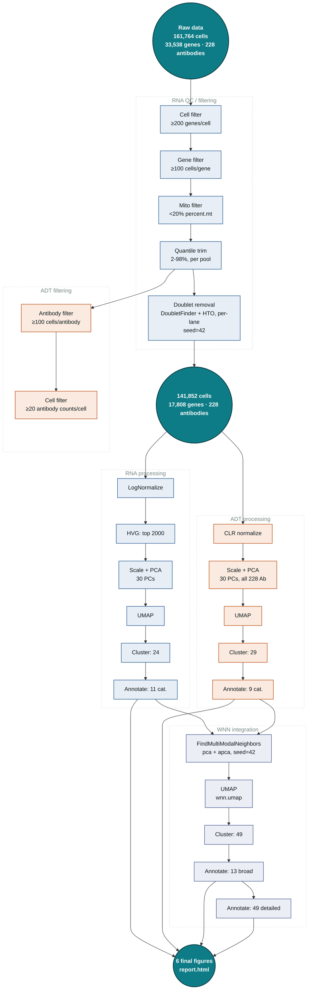

# Integrated Analysis of Single-Cell Multiomics Data Using CITE-seq

A from-scratch, step-by-step rebuild of the CITE-seq analysis pipeline
already validated in `citeseq_learn_v2`, built incrementally in a fresh
conda environment (`citeseq-pipeline`) rather than cloning the working
environment wholesale. Each step is run and checked individually before
moving to the next. The pipeline is now complete end-to-end: raw data →
QC/filtering → independent RNA and ADT processing → WNN integration →
final combined annotation.

📊 **[CITE-seq Analysis Report](https://claude.ai/code/artifact/7966cdf7-365d-4a2b-8d4f-81e619d4259e)**

## Contents

- [1. Data](#1-data)
- [2. Computational Methods](#2-computational-methods)
- [3. Environment Setup](#3-environment-setup)
- [4. Analysis Workflow](#4-analysis-workflow)
- [5. Running the Analysis Workflow](#5-running-the-analysis-workflow)
- [6. Directory Structure](#6-directory-structure)
- [7. Output Files](#7-output-files)
- [8. Notes](#8-notes)
- [9. References](#9-references)


## 1. Data

**Source:** GEO accession [GSE164378](https://www.ncbi.nlm.nih.gov/geo/query/acc.cgi?acc=GSE164378) ^<br>
**Files:** `GSM5008737 PBMC CITE-seq RNA_3P {barcodes,features,matrix}` (RNA: 33,538 genes × 161,764 cells, ~1.05 GB) and `GSM5008738 PBMC CITE-seq ADT_3P {barcodes,features,matrix}` (ADT: 228 antibodies × 161,764 cells, ~100 MB) <br>
**Design:** 161,764 cells across 13 sequencing lanes in 2 donor pools <br>

^ Please manually download the raw data from NCBI GEO GSE164378 samples `GSM5008737` and `GSM5008738`, and place the files in the
`data/` folder.

Barcodes carry a lane prefix identifying the 13 sequencing lanes across
the two donor pools (`L_pool`: lanes `L1`–`L5` (67,090 cells); `E2_pool`: lanes `E2L1`–`E2L8` (94,674 cells))

reference/hto_doublet_calls.csv contains per-cell hashtag oligonucleotide (HTO)-based doublet/singlet calls derived from 
Hao et al. datasets (2021). It provides barcode-level annotations used in the pipeline to identify and 
remove cells classified as HTO Doublets. <br>

reference/KEGG_RIBOSOME.txt contains a list of human RPL and RPS ribosomal gene set obtained from MSigDB. It serves as a reference for identifying ribosome-related expression.

Barcodes carry a lane prefix identifying the 13 sequencing lanes across
the two donor pools (`L_pool`: lanes `L1`–`L5` (67,090 cells); `E2_pool`: lanes `E2L1`–`E2L8` (94,674 cells))


## 2. Computational Methods

`scripts/` contains the following files:

| Script | Description |
|---|---|
| `run_pipeline.sh` | Master script |
| `01_rna_qc_filter.R` | RNA QC |
| `02_adt_qc_filter.R` | ADT QC |
| `03_rna_umap.R` | RNA UMAP |
| `04_adt_umap.R` | ADT UMAP |
| `05_wnn_integration.R` | WNN-based multimodal Integration |

### RNA QC

| Step | Before | After | Removed | Notes |
|---|---|---|---|---|
| Build Seurat object (RNA+ADT) | 161,764 cells | 161,764 cells | — | 33,538 genes, 228 antibodies |
| Cell filter (≥200 genes/cell) | 161,764 cells| 161,764 cells| 0 | All cells retained |
| Gene filter (≥100 cells/gene) | 33,538 genes | 17,808 genes | 15,730 genes | — |
| Mito filter (<20% `percent.mt`) | 161,764 cells | 161,764 cells | 0 | All cells retained |
| Quantile trim (2–98%, per pool) | 161,764 cells | 153,822 cells | 7,942 cells | — |
| Doublet removal (DoubletFinder + HTO, union) | 153,822 cells | **141,852 cells** | 11,970 cells | Doublets were identified and removed independently within each sequencing lane: 11,537; HTO-based detection: 508; overlap: 75 |

DoubletFinder per-lane breakdown:

| Lane | Cells | Doublets | Singlets |
|---|---|---|---|
| E2L1 | 10,895 | 817 | 10,078 |
| E2L2 | 11,531 | 865 | 10,666 |
| E2L3 | 10,789 | 809 | 9,980 |
| E2L4 | 10,867 | 815 | 10,052 |
| E2L5 | 11,536 | 865 | 10,671 |
| E2L6 | 11,478 | 861 | 10,617 |
| E2L7 | 11,448 | 859 | 10,589 |
| E2L8 | 11,485 | 861 | 10,624 |
| L1 | 13,135 | 985 | 12,150 |
| L2 | 12,462 | 935 | 11,527 |
| L3 | 11,601 | 870 | 10,731 |
| L4 | 12,721 | 954 | 11,767 |
| L5 | 13,874 | 1,041 | 12,833 |
| **Total** | **153,822** | **11,537** | **142,285** |

### ADT QC

| Step | Before | After | Removed | Notes |
|---|---|---|---|---|
| Cell filter (≥20 Ab counts/cell) | 153,822 cells | **153,822 cells** | 0 | All cells retained |
| Antibody filter (≥100 cells/Ab) | 228 Ab | **228 Ab** | 0 | All antibodies retained |

### RNA UMAP

| # | Step | Result |
|---|---|---|
| 10 | `LogNormalize`, scale.factor=10000 | 141,852 cells × 17,808 genes |
| 11 | `FindVariableFeatures`, vst, top 2000 | 2000 HVGs (top: HBB, HBA2, HBA1, CCL4L2, CCL20) |
| 12 | `ScaleData` + `RunPCA`, 30 PCs, seed=42 | PC1 explains 52.4% of variance |
| 13 | `RunUMAP` on `pca`, dims 1:30, seed=42 | `umap.rna` embedding (no plot) |
| 14 | `FindNeighbors`+`FindClusters`, algorithm=3, resolution=0.5, seed=42 | 24 clusters |
| 15 | `FindAllMarkers`, RNA restricted to 2000 HVGs | 7,446 marker rows |
| 16 | Manual marker-based annotation | 12 broad categories |
| 17 | Labeled RNA UMAP plot | `results/03_rna_umap_broad_labels.png` |

RNA broad lineage breakdown (141,852 cells): CD4 T 40,017 · CD8 T 37,669 ·
Monocyte 44,393 · NK 12,572 · B cell 12,605 · gdT/NK 4,062 · MAIT 4,046 ·
DC 644 · Proliferating 540 · HSPC 148 · ILC 25 · pDC 15.

Two labels were corrected after cross-checking against the UMAP embedding
(marker signal alone was ambiguous for both): cluster 15 (`TNF`/`CCL3`/
`CCL4`/`NFKBIA`) embeds inside the Monocyte island — relabeled Monocyte,
not "T cell (activated)". Cluster 22 (`KIT`/`GATA3`/`IL1R1`/`SPINK2`)
embeds within the CD8 T/NK lymphoid branch, far from the true HSPC
cluster — relabeled ILC, not "HSPC/Basophil".

### ADT UMAP

| # | Step | Result |
|---|---|---|
| 18 | `CLR`, margin=2 | 141,852 cells × 228 antibodies |
| 19 | `ScaleData` + `RunPCA`, all 228 antibodies, 30 PCs, seed=42 | PC1 explains 30.5% of variance (flatter than RNA's 52.4%) |
| 20 | `RunUMAP` on `apca`, dims 1:30, seed=42 | `umap.adt` embedding (no plot) |
| 21 | `FindNeighbors`+`FindClusters`, algorithm=3, resolution=0.5, seed=42 | 29 clusters |
| 22 | `FindAllMarkers`, all 228 antibodies | 1,290 marker rows |
| 23 | Manual marker-based annotation | 9 broad categories |
| 24 | Labeled ADT UMAP plot | `results/04_adt_umap_broad_labels.png` |

ADT broad lineage breakdown (141,852 cells): Monocyte 42,480 · CD4 T
38,017 · CD8 T 25,003 · NK 16,954 · B cell 12,623 · MAIT 2,614 · DC 2,602 ·
gdT 1,370 · HSPC 189.

ADT surface-protein markers were more directly interpretable than RNA
gene markers for several lineages — `TCR-Va7.2` (MAIT), `TCR-Vg9`/
`TCR-Vd2` (gdT), `CD34`/`CD117`/`CD133` (HSPC), `CD103` (tissue-resident
CD8 T), and `CD141` (cDC1) are all near-definitive single-protein
identity markers.

### WNN-based multimodal integration

| # | Step | Result |
|---|---|---|
| 25 | `FindMultiModalNeighbors`, `pca`+`apca`, dims 1:30 each, seed=42 | Joint `wknn`/`wsnn` graphs. RNA weight: median 0.55, ranges near-0 to 1.0 per cell |
| 26 | `RunUMAP` on the WNN graph, seed=42 | `wnn.umap` embedding (no plot) |
| 27 | `FindClusters` on `wsnn`, algorithm=3, resolution=1.2, seed=42 | 49 clusters (`wnn_clusters`, kept separate from RNA's `seurat_clusters`) |
| 28 | `FindAllMarkers`, both RNA (2000 HVGs) and ADT (228 antibodies) | 13,194 RNA + 2,155 ADT marker rows |
| 29 | Manual annotation using RNA+ADT markers together | 13 broad categories |
| 30 | Labeled WNN UMAP plot (broad) | `results/05_wnn_umap_broad_labels.png` |
| 31 | Per-cluster detailed annotation, all 49 clusters | `results/05_wnn_detailed_annotation.csv` |
| 32 | Labeled WNN UMAP plot (detailed, numbered + grouped legend) | `results/05_wnn_umap_detailed_labels.png` |

WNN broad lineage breakdown (141,852 cells): Monocyte 43,419 · CD4 T
38,068 · CD8 T 25,065 · NK 16,259 · B cell 12,602 · MAIT 2,621 · gdT
1,350 · DC 986 · Platelet 711 · Proliferating 547 · HSPC 148 · ILC 42 ·
Erythrocyte 34.

Having both modalities' evidence together at this stage resolved several
calls neither single-modality analysis could on its own — e.g. cluster
12's inflammatory-monocyte signature (`TNF`/`CCL3`/`NFKBIA` RNA +
`CD64`/`CD86`/`CD11b` ADT) is unambiguous here, and clear Platelet
(`ITGA2B`/`PF4`/`PPBP` + `CD42b`/`CD61`) and CD56bright NK (`XCL1`/`XCL2`
+ `CD56`/`CD117`) populations emerged that neither single-modality pass
isolated cleanly.

One finding worth noting explicitly: a 34-cell "Erythrocyte" cluster
embeds spatially *inside* the CD4 T region rather than as its own
island. Checked directly rather than assumed — its markers show real
hemoglobin/RBC signal (`HBB`, `HBA1/2`, `CD235a`) *mixed with* CD4 T
signal (`CD4-2` protein present too), the signature of ambient RNA/
protein contamination (lysed RBCs releasing free hemoglobin into
droplets that also contain a real CD4 T cell) rather than a labeling
error. Kept as its own category, matching the reference paper's own
convention of reporting a small Erythrocyte class.

### Methodology notes

- **RNA and ADT are normalized independently** (`LogNormalize` vs. `CLR`)
  since they have fundamentally different statistical properties, then
  combined via WNN integration (script 25) — not at normalization.
- **ADT has no HVG-selection-equivalent step.** With only 228 antibodies
  total — a panel deliberately curated to be informative, unlike RNA's
  whole transcriptome — all of them are used directly as PCA input.
- **Doublet detection runs per lane, not per pool or globally.** A doublet
  physically forms within one droplet-generation run (one lane); pooling
  by sample-pool (~95k–127k cells) OOM-crashed twice in the reference
  project — per-lane (~11k–15k cells) is the scale that works.
- **Both doublet-detection methods are run and cross-checked, not just
  one.** DoubletFinder and HTO-based calls are structurally blind to
  different failure modes; they overlap on only 75 of 11,970 flagged
  cells. Cells are removed if flagged by **either** method — a true
  union (logical OR), not an intersection:
  ```r
  obj$is_doublet <- (obj$doublet_finder_call == "Doublet") |
                     (!is.na(obj$hto_doublet_call) & obj$hto_doublet_call == "Doublet")
  ```
  This choice matters: an intersection (only removing cells both
  methods agreed on) would have kept 11,895 of the 11,970 flagged cells
  in the data — union is what actually lets each method catch what the
  other one structurally can't. HTO-based calls come from
  `reference/hto_doublet_calls.csv` — a
  small, portable (~5 MB), git-friendly barcode → Doublet/Singlet
  lookup, extracted once from a 2 GB intermediate object (this repo
  doesn't implement its own HTO demultiplexing). See "Data" and
  "References" above/below for exactly where these calls originate.
- **Quantile trim is computed per pool**, matching the real, confirmed
  batch effect between `L_pool`/`E2_pool` (Wilcoxon `p < 2.2e-16`), and
  must run *after* doublet removal — percentiles are recomputed from
  whichever cells are currently present.
- **WNN clustering uses a distinct metadata column** (`wnn_clusters`),
  not the default `seurat_clusters` — since the same object already
  carried RNA-only clusters from script 14, letting `FindClusters` use
  its default column name would have silently overwritten them (same
  precaution applied to ADT's `adt_clusters` in script 21).
- **Combined RNA+ADT marker evidence at the WNN stage resolved several
  calls that were ambiguous with either modality alone** — see the WNN
  section above. This is the concrete benefit of doing single-modality
  analysis first and integration second, rather than jumping straight to
  WNN: it makes the value of integration visible and checkable, not just
  assumed.


## 3. Environment Setup

Conda env `citeseq-pipeline` (R 4.5.3), built package-by-package as each
step needed something new. Location is whatever `conda`/`mamba` uses by
default on your machine (typically `<conda install prefix>/envs/citeseq-pipeline`).

Key package versions:

| # | Package | Version | Source |
|---|---|---|---|
| 1 | `r-base` (R) | 4.5.3 | conda-forge |
| 2 | `Seurat` | 5.5.1 | conda-forge |
| 3 | `Matrix` | 1.7.5 | conda-forge |
| 4 | `DoubletFinder` | 2.0.6 | GitHub (`chris-mcginnis-ucsf/DoubletFinder`) |

### `renv.lock`

The project is also `renv`-tracked (147 packages, exact versions, R
4.5.3), same as `RNA-seq`. `renv.lock` itself is fully portable — plain
JSON, no local paths, safe to publish as-is. The DoubletFinder entry
pins the exact GitHub commit SHA installed, not just a version tag.

`renv/settings.json`'s `external.libraries` is deliberately left empty
(`[]`) — not a local shortcut, a correctness requirement. renv's
activation tries to *create* every path listed there if it doesn't
already exist, and hard-crashes (`Error: failed to create directory...`)
if it can't — which it never could on anyone else's machine, since the
only path that would ever go there is specific to one machine's home
directory. An empty list is the only setting that's safe on every clone.

Local convenience without that risk comes from branching in
`run_pipeline.sh` instead, auto-detected, no config needed either way:

- **conda env `citeseq-pipeline` found** (the case on the machine this
  was built on): activates it, then runs each script from `scripts/`
  (no `.Rprofile` there) — renv never activates, packages come straight
  from conda.
- **no matching conda env** (a fresh GitHub clone): runs each script
  from the **project root** instead, so renv's `.Rprofile` activates and
  packages come from `renv/library/`.

**No manual package setup needed either way.** In the second case,
`run_pipeline.sh` checks whether Seurat/DoubletFinder are already
installed and, if not, runs `renv::restore()` **automatically** before
proceeding — including an automatic retry if the first attempt hits the
parallel-install race condition described below. A downloader only
needs to: clone the repo, drop the 6 raw data files into `data/`, and
run `./scripts/run_pipeline.sh`. Verified end-to-end with a live test
(fresh clone simulation, no conda, empty `renv/library/`): it detected
the missing packages, ran `renv::restore()` unprompted, and moved
straight into real pipeline execution with no manual step in between.

Either way, each script's own `project_dir`/`data_dir` detection is
based on the script's own file location, not the working directory, so
which branch runs never affects where inputs/outputs are read or
written.

Two ways to get a working package set — `run_pipeline.sh` picks
automatically per above, but either can also be run manually first if
preferred:

**Recreate via conda-forge** (fast, prebuilt binaries, matches how this
env was actually built) — pins the 12 key packages above by exact
version, plus DoubletFinder's exact GitHub commit:
```
mamba create -n citeseq-pipeline -c conda-forge \
  r-base=4.5.3 r-seurat=5.5.1 r-seuratobject=5.4.0 r-matrix=1.7_5 \
  r-ggplot2=4.0.3 r-patchwork=1.3.2 r-dplyr=1.2.1 r-ggrepel=0.9.8 \
  r-scales=1.4.0 r-viridislite=0.4.3 r-data.table=1.18.4 \
  r-remotes=2.5.0 r-fields=17.3 r-rocr=1.0_12
conda activate citeseq-pipeline
Rscript -e 'remotes::install_github("chris-mcginnis-ucsf/DoubletFinder", ref = "1b244d8f0d54b4b1cb4365639931bbb16f01e1cd")'
```
The remaining ~135 packages in `renv.lock` are transitive dependencies
(Rcpp, RcppArmadillo, uwot, igraph, etc.) — this command doesn't pin
those individually; conda's solver picks compatible versions from
conda-forge at install time, which won't necessarily match
`renv.lock`'s exact versions package-for-package, just functionally
compatible ones. That's the real tradeoff versus the option below.

**Or `renv::restore()`** (the only path that reproduces all 147 package
versions exactly, byte-for-byte matching `renv.lock` — but compiles from
source, so expect significantly longer, and a working C++/Fortran
toolchain):
```
Rscript -e 'renv::restore()'
```

Actually tested end-to-end (isolated scratch copy, plain system R, no
conda) — `renv::restore()` works, but **may fail on the first attempt**
with `Error: failed to install "Seurat", "DoubletFinder", ...` due to a
parallel-install race: renv installs packages concurrently, and a few
(`crosstalk`, `gridExtra`, `scattermore`) can start building before
`rlang` — one of their own dependencies — finishes compiling elsewhere.
**Just run `Rscript -e 'renv::restore()'` again** — the second attempt
reuses everything already built (`renv`'s package cache persists across
runs), so it finishes in under 5 minutes and succeeds cleanly. Confirmed
by actually hitting this failure, retrying, and verifying `library(Seurat)`
and `library(DoubletFinder)` both load correctly afterward.

### Reproducibility / seeding

Single project-wide seed, **42**, used everywhere a seed is needed:
`set.seed(42)` at the top of scripts with stochastic steps, and
`seed.use = 42` explicitly passed to any Seurat function that accepts it
(`RunPCA`, `RunUMAP`, `FindClusters`'s `random.seed`).


## 4. Analysis Workflow




## 5. Running the Analysis Workflow

After completing setup per "Environment Setup" above (raw data already
in `data/`), the pipeline can be run in two ways.

### A. Manual Execution

Run `scripts/run_pipeline.sh` — it auto-detects whether to use the local
conda env or renv (installs packages automatically via `renv::restore()`
if needed), runs all 5 scripts below in order, logs each one's full
output to `logs/<timestamp>_<step>.log`, and stops immediately on the
first failure. Expect ~1.5-2.5 hours total (plus install time on a fresh
clone with no packages yet).

```bash
cd multiomics/   # run from the project root
./scripts/run_pipeline.sh
```

Or invoke each of the 5 scripts individually, in order:

```bash
conda activate citeseq-pipeline   # or rely on renv, see Environment Setup

Rscript scripts/01_rna_qc_filter.R
Rscript scripts/02_adt_qc_filter.R
Rscript scripts/03_rna_umap.R
Rscript scripts/04_adt_umap.R
Rscript scripts/05_wnn_integration.R
```

### B. Snakemake

`Snakefile` (project root) wraps the same 5 scripts as DAG-tracked
rules, same pattern as the `RNA-seq` project — `RSCRIPT =
config.get("rscript", "Rscript")`, so it points at whatever R you give
it rather than assuming a specific env. Unlike `run_pipeline.sh`, it
tracks per-file dependencies: if you edit one script and rerun, only
that rule (and anything downstream of it) re-executes, not the whole
pipeline. `adt_qc_filter` (step 7-8) is a side-branch — its outputs
feed nothing downstream, matching the "orphan checkpoint" note above —
so it's listed explicitly in `rule all` or it wouldn't run at all.

Snakemake requires a separate environment from the R project environment
managed by `renv`. To create the environment:

```bash
mamba create -n snakemake_env -c bioconda -c conda-forge \
  --no-channel-priority snakemake-minimal=9.23.1
```

Run from the project root with the `snakemake_env` environment active:

```bash
conda activate snakemake_env

snakemake -n --cores 1                                   # dry run
snakemake --cores 1                                       # real run, "Rscript" on PATH (conda env activated first)
snakemake --cores 2 --config rscript=/path/to/citeseq-pipeline/bin/Rscript
```

**Conda env only, not `renv::restore()`.** Each rule `cd`s into
`scripts/` before invoking R, same as `run_pipeline.sh`'s conda branch —
necessary because Snakemake's shell commands run with cwd = the project
root, which has `.Rprofile`, so without the explicit `cd`, renv would
activate on every single rule invocation and (since
`renv/settings.json`'s `external.libraries` is empty, on purpose — see
"Environment Setup" above) hide the conda env's packages entirely.
Confirmed by actually hitting this exact failure before adding the `cd`.
But that same `cd` means renv never activates either, so
`renv/library/` (where `renv::restore()` installs) is never reachable
from here — **if you used `renv::restore()` instead of conda, use
`run_pipeline.sh`, not this**; it auto-detects and runs from the project
root specifically so renv can activate. Raw data must already be in
`data/` either way, same as `run_pipeline.sh`.

Verified with a real dry-run (correct 5-rule DAG, correct dependency
ordering, `adt_qc_filter` correctly resolved as a non-blocking
side-branch), a real incremental-rerun test (touching one script's mtime
correctly triggered only that rule to re-run, everything else stayed
marked up to date), and a real full execution of the entire DAG
end-to-end (all 5 rules, conda env's R — completed successfully with 0
errors, 141,852 cells / 49 WNN clusters / 13 broad lineage categories in
the final output, matching the already-independently-verified numbers
throughout this README exactly).


## 6. Directory Structure

```
multiomics/
├── README.md
├── report.html                     # interactive report
├── Snakefile                       # optional Snakemake workflow
├── .Rprofile                       # activates renv for this project
├── renv.lock                       # 147 packages, exact versions, R 4.5.3
├── renv/                           # renv infrastructure
│   ├── activate.R
│   ├── settings.json                
│   └── .gitignore                   
├── data/                            
│   ├── GSM5008737 RNA_3P {barcodes,features,matrix}^  # manually download
│   └── GSM5008738 ADT_3P {barcodes,features,matrix}^  # manually download
├── reference/
│   ├── KEGG_RIBOSOME.txt          # ribosomal gene reference list
│   └── hto_doublet_calls.csv      # HTO-based doublet/singlet calls
├── results/                       # figures save here too, alongside their data
│   ├── 01_rna_seurat_object_raw.rds
│   ├── 01_rna_qc_report_summary.png
│   ├── 01_rna_qc_filter_cell.csv
│   ├── 01_rna_qc_filter_gene.csv
│   ├── 01_rna_qc_filter_mito.csv
│   ├── 01_rna_qc_filter_quantile.csv       + 01_rna_seurat_object_quantile_trim.rds
│   ├── 01_rna_doublet_summary.csv          + 01_rna_seurat_object_doublet_filtered.rds
│   ├── 02_adt_qc_filter.csv                + 02_adt_seurat_object_filtered.rds  (orphan checkpoint, see table above)
│   ├── 02_adt_qc_report_summary.png
│   ├── 03_rna_cluster_markers.csv
│   ├── 03_rna_broad_annotation.csv         + 03_rna_seurat_object_annotated.rds
│   ├── 03_rna_umap_broad_labels.png
│   ├── 04_adt_cluster_markers.csv
│   ├── 04_adt_broad_annotation.csv         + 04_adt_seurat_object_annotated.rds
│   ├── 04_adt_umap_broad_labels.png
│   ├── 05_wnn_cluster_markers_RNA.csv + 05_wnn_cluster_markers_ADT.csv
│   ├── 05_wnn_broad_annotation.csv
│   ├── 05_wnn_umap_broad_labels.png
│   ├── 05_wnn_detailed_annotation.csv      + 05_wnn_seurat_object_detailed.rds
│   └── 05_wnn_umap_detailed_labels.png
└── scripts/
    ├── run_pipeline.sh            (master script)
    ├── 01_rna_qc_filter.R      
    ├── 02_adt_qc_filter.R      
    ├── 03_rna_umap.R           
    ├── 04_adt_umap.R           
    └── 05_wnn_integration.R    
```


## 7. Output Files

In `results/`, produced by the 5 scripts described in "Computational
Methods" above:

- **`01_rna_*`** — raw and quantile-trimmed Seurat object checkpoints
  (`.rds`), the RNA QC report figure, per-filter CSVs (cell/gene/mito/
  quantile), the doublet-removal summary CSV, and the final
  doublet-filtered Seurat object.
- **`02_adt_*`** — the ADT-filtered Seurat object checkpoint, its filter
  CSV, and the ADT QC report figure.
- **`03_rna_*`** — RNA cluster markers CSV, broad annotation CSV, the
  labeled RNA UMAP PNG, and the RNA-annotated Seurat object checkpoint.
- **`04_adt_*`** — ADT cluster markers CSV, broad annotation CSV, the
  labeled ADT UMAP PNG, and the ADT-annotated Seurat object checkpoint.
- **`05_wnn_*`** — RNA and ADT cluster markers CSVs, broad and detailed
  annotation CSVs, the broad- and detailed-labeled WNN UMAP PNGs, and
  the final WNN-integrated Seurat object checkpoint (cumulative — see
  "Directory Structure" above).

`report.html` — a self-contained dashboard (all 6 figures embedded as
base64, no external assets) presenting the QC → single-modality → WNN
integration structure with a sidebar TOC, stat-grid summary, and
click-to-zoom lightbox, built in the exact format of
`citeseq_final_plots/report.html`.


## 8. Notes

Code was developed with assistance from Claude, an AI coding assistant, 
based on author-defined step-by-step specifications, analytical objectives, and methodological 
decisions. The generated code was iteratively refined, reviewed by the author, and 
validated by reproducing and comparing with major results reported in the original publication.


## 9. References

Hao, Y., Hao, S., Andersen-Nissen, E., Mauck, W. M., Zheng, S., Butler,
A., Lee, M. J., Wilk, A. J., Darby, C., Zager, M., Hoffman, P.,
Stoeckius, M., Papalexi, E., Mimitou, E. P., Jain, J., Srivastava, A.,
Stuart, T., Fleming, L. B., Yeung, B., Rogers, A. J., McElrath, M. J.,
Blish, C. A., Gottardo, R., Smibert, P., & Satija, R. (2021). Integrated
analysis of multimodal single-cell data. *Cell*, *184*(13), 3573–3587.e29.
https://doi.org/10.1016/j.cell.2021.04.048
